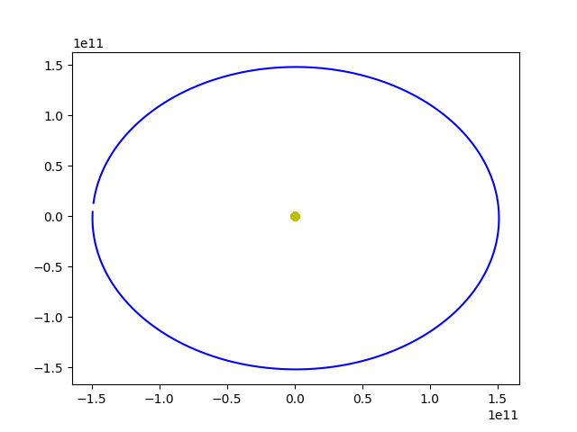

# N-Body Simulation Engine

This project aims to simulate the gravitational interactions between celestial
bodies using Newton's laws of motion. As an educational software engineering
exercise, the development of this engine strictly follows the pragmatic
development philosophy: **"Make it work, Make it right, Make it fast."**

## 1. Make It Work (Prototyping Phase)

*Status: Currently in Progress*

The primary objective of this phase is to rapidly prototype the core physics
loop and prove that the fundamental logic is correct before worrying about
software architecture or extreme optimizations.

### 1.1 Project Objective

At this stage, we are writing a monolithic procedural flow. We ingest
real-world astronomical data directly from NASA's Horizons Ephemeris System,
parse it into memory, and bootstrap the "Universe" to eventually run an
O(N^2) Explicit Euler numerical integration. The goal is to obtain
functional data output that we can later analyze to measure the integration
error of the Euler method against real orbital mechanics.

### 1.2 The `Pianeta` Constructor Explained

In Object-Oriented Programming (OOP) with C++, a constructor is a special
class method invoked automatically when a new object is created in memory.

```cpp
Pianeta::Pianeta(double m, double x, double y, double z, double vx, double vy,
                 double vz)
    : m(m), x(x), y(y), z(z), vx(vx), vy(vy), vz(vz),
      fx(0), fy(0), fz(0) {}
```

In our engine, the `Pianeta` (Planet) class represents a celestial entity.
Its constructor takes the invariant physical mass (`m`) and the initial state
vectors (spatial coordinates `x, y, z` and velocity vectors `vx, vy, vz`).

Notice the syntax following the colon (`:`). This is known as a **Member
Initializer List**. While you could assign variables inside the curly braces
`{}`, the initializer list is the C++ academic standard because it initializes
the members directly when they are structurally allocated, which is
significantly more efficient than creating them and then reassigning their
values. Furthermore, we deliberately initialize our force accumulators
(`fx`, `fy`, `fz`) to `0` since a newly instantiated planet is not yet under
the influence of the universe.

### 1.3 Parsing CSV Data: `std::getline` and `std::stringstream`

To populate our universe, we need to read empirical data from CSV
(Comma-Separated Values) text files.

**The Role of `std::getline`:**
`std::getline` is a standard library function used to read characters from an
input stream (like our `std::ifstream fs` file stream) and append them to a
string object until it encounters a delimiter string. By default, this
delimiter is the newline character (`\n`).
In our project, we use it to read the text file line by line:
`while (std::getline(fs, line))` reads the file sequentially. Once we find
the NASA keyword `$$SOE` (Start Of Ephemeris), we know the data matrix has
begun.

**The Role of `std::stringstream`:**
Once we have extracted a single line of data (which looks like
`text, text, 1.45, 2.56, ...`), we need to tokenize (split) it based on the
commas. This is where `std::stringstream` shines. It takes a raw string and
wraps it in a stream interface, allowing us to treat the string exactly as if
it were an incoming file stream.

```cpp
std::stringstream ss(line);
std::getline(ss, word, ','); // Extract up to the first comma!
```

By explicitly providing `','` as the third parameter to a secondary
`std::getline()` call, we instruct C++ to parse the string chunk by chunk,
stopping at every comma. We can then bypass the irrevelant datetime columns
and isolate the X, Y, Z and Vx, Vy, Vz components, converting them from strings
to floating-point numbers (`std::stod()`) and scaling them from kilometers to
meters.

### 1.4 The O(N^2) N-Body Computational Logic

The physical core of the simulation relies on a discretized time-step approach
(`dt = 86400` seconds, corresponding to 1 Earth day). The simulation completes
one terrestrial year (365 iterations). Each discrete step implements a rigorous
3-phase logic constraint:

1. **Force Reset (O(N))**: Prior to spatial translation, the accumulated
gravity vector components of all entities are zeroed out via a range-based
loop.
2. **Pairwise Gravitational Imprint (O(N^2))**: A nested iterative structure
iterates through all `i` and `j` particles. Excluding self-interaction
(`i != j`), it applies Newton's law of universal gravitation to determine the
mutual attraction force magnitude and the relative orthogonal distribution
vectors.
3. **Explicit Euler Integration (O(N))**: Having assimilated the total effect
of the computational universe, the internal state vectors of each body
(`vx`, `vy`, `vz` and `x`, `y`, `z`) are updated iteratively using the
Explicit Euler forward step.

### 1.5 Data Visualization and Euler Integration Error

To empirically validate the simulated physics, the application utilizes the
`matplotlib-cpp` library, dynamically plotting the orbital trajectory vectors
at runtime:

```cpp
matplotlibcpp::plot(earth_x, earth_y, "b-"); // Trajectory profile (Earth)
matplotlibcpp::plot(sun_x, sun_y, "yo");     // Massive Anchor point (Sun)
matplotlibcpp::show();
```



**Analytical Conclusion of the Prototyping Phase:**

The graphical output successfully visualizes a functioning celestial orbit.
However, a critical numerical artifact is prominent: **The elliptical
trajectory fails to perfectly seal exactly at the point of origin.** Instead
of returning stably to the departure coordinates, the orbital path spirals
slightly outwards.

This "runaway" behavior dramatically confirms the inherent defect of the
mathematically naive **Explicit Euler Integrator**. It is intrinsically
**non-symplectic**; meaning it erroneously violates the Principle of
Conservation of Mechanical Energy. At every time-step, it slightly overshoots
the true tangent velocity vector, artificially injecting kinetic energy into
the planetary system and gradually expanding the semi-major axis over time.
This definitive confirmation successfully concludes the "Make It Work" phase,
as we have effectively formulated, reproduced, and diagnosed the raw N-Body
physics engine.

*(Disclaimer: While a physicist would now spend weeks analyzing energy drift,
changing integration schemes, and validating time-steps, our primary educational 
goal is to master C++ Software Engineering. Therefore, we will deliberately skip
deep numerical analysis and pivot immediately to Architectural Refactoring.)*

## 2. Make It Right (Refactoring Phase)

*Status: Currently in Progress*

Once the physical computational loop output mathematically correct data inside
our monolithic `main` function, this phase pivots entirely towards pure
Software Engineering paradigms. We abandoned the single-file procedural
approach to construct a scalable Object-Oriented architecture.

### 2.1 The "Strategy" Design Pattern and Interfaces

To decouple the management of the celestial bodies from the mathematical
integration logic (which could change from Euler to Verlet or Leapfrog in the
future), we implemented the **Strategy Pattern**.

In C++, this is achieved via an Interface (an abstract base class with a pure
virtual function `virtual ... = 0;`).

```cpp
class IIntegrator {
public:
  virtual ~IIntegrator() = default;
  virtual void doStep(std::vector<Pianeta> &universe, double dt) = 0;
};
```

The `EulerIntegrator` class inherits from this interface and fulfills the
contract by providing the concrete O(N^2) mathematical implementation.

### 2.2 Dependency Injection orchestrating the `SolarSystem`

The universe simulation space is now encapsulated securely within the
`SolarSystem` class. This class knows absolutely nothing about the underlying
physics engine. It simply holds a pointer to the abstract `IIntegrator`
interface:

```cpp
class SolarSystem {
private:
  std::vector<Pianeta> universe;
  IIntegrator *integrator; // The interchangeable physics engine
public:
  SolarSystem(IIntegrator *integrator);
  void integrate(double dt) { integrator->doStep(universe, dt); }
};
```

This is a textbook example of **Dependency Injection** and **Loose Coupling**.
The orchestrator in `main.cpp` creates the specific engine and injects it:
`SolarSystem solarSystem(&eulerIntegrator);`

### 2.3 Const Correctness and High-Performance Encapsulation

By making the `universe` array `private`, we successfully shielded the
planetary data from accidental external manipulation. However, our graphical
plotter in `main.cpp` requires Read-Access to the coordinates to draw the
orbit.

To avoid a catastrophic performance drop (copying an entire array of planets
every discrete step), we exposed the data using a **Constant Reference Getter**:

```cpp
const std::vector<Pianeta> &getUniverse() const;
```

1. The `&` symbol ensures we return a memory reference, completely bypassing
the O(N) copy overhead.
2. The `const` keywords mathematically guarantee to the C++ compiler that the
returned data is strictly **Read-Only**.

To legally support this read-only access, the primitive properties of the
Planets were also academically labeled as constant (e.g., `double getX() const;`),
achieving complete **Const Correctness** throughout the entire software stack.

## 3. Make It Fast (Optimization Phase)

*Status: Pending*

The final stage of development involves removing computational bottlenecks.
Since the naive N-body interaction algorithm scales quadratically – O(N^2) –
we will explore symplectic integrators (like Velocity Verlet for vital energy
conservation over time) and study advanced algorithmic reductions such as the
Barnes-Hut tree or hardware-accelerated Vectorization (SIMD) to dramatically
increase algorithmic efficiency.
